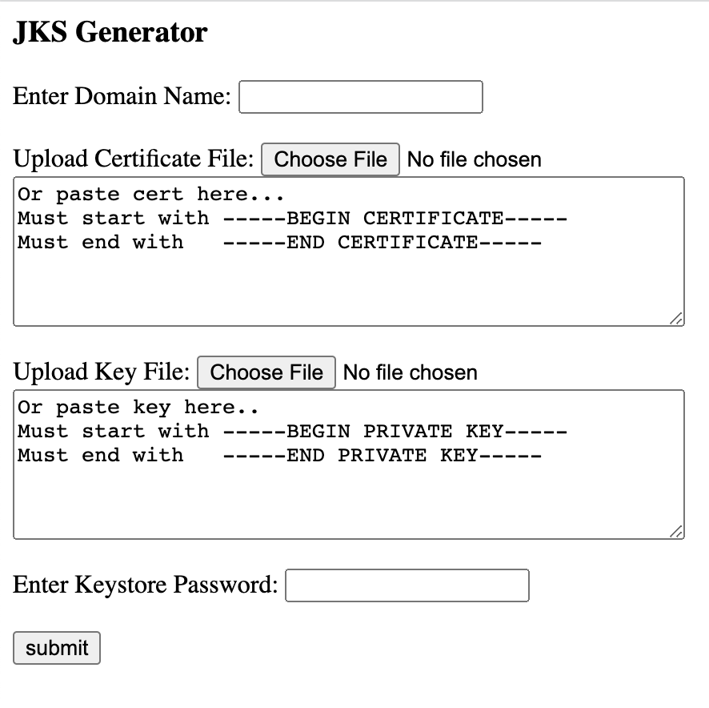

# JavaKeyStoreGenerator
Here is another tool I created as part of my in-house IT automation tools and packages I developed over the years of working as an IT system administrator. 
It's a web app that accepts an SSL certificate and key file as input and outputs a JKS (Java Keystore) certificate.
 
 

## Requirements
- PHP version >= 7.2
- libexpect version >= 5.43.0
- PHP [expect](https://www.php.net/manual/en/book.expect.php)

## Documentation
